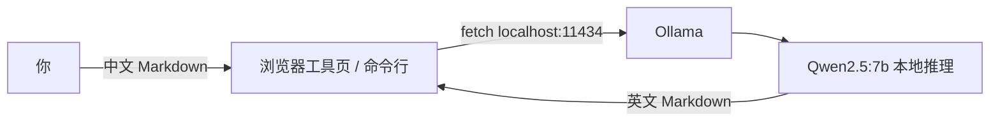

# 前言

本文具有强烈的个人感情色彩,如有观看不适,请尽快关闭. 本文仅作为个人学习记录使用,也欢迎在许可协议范围内转载或分享,请尊重版权并且保留原文链接,谢谢您的理解合作. 如果您觉得本站对您能有帮助,您可以使用RSS方式订阅本站,感谢支持!

---

## 一、本地免费翻译是什么

大模型（LLM）不仅能聊天写代码，翻译也是它的强项。但多数人第一反应是开个 ChatGPT 或翻译 API——要联网、要账号、要付费，内容还得出境。

其实你自己的 Mac 就能跑一个开源大模型，离线把中文 Markdown 翻成英文，**全程免费、不上传、断网也能用**。本文带你从零把这套环境装好、用起来。

核心三件套：

- **Ollama**：本地大模型运行框架（负责把模型跑起来，类似 Docker）
- **Qwen2.5**：阿里开源大模型，中英文都强、翻译质量好，Mac 上 7B 流畅
- **你的浏览器**：通过工具页调用本机模型，不碰命令行也能翻译



---

## 二、前置要求（装之前先看这里）

### 硬件要求

| 项目 | 最低要求 | 推荐配置 | 说明 |
| --- | --- | --- | --- |
| Mac 芯片 | Apple Silicon（M1 及以上） | M1 Pro / M2 / M3 / M4 任意 | Intel Mac 能跑但慢，Apple Silicon 有 MLX 加速 |
| 内存 | 8 GB | **16 GB** | 8GB 只能跑 3B；16GB 跑 7B 无压力；跑 14B 建议 32GB |
| 硬盘剩余空间 | 15 GB | 20 GB+ | 模型权重约 5~10 GB，Jekyll + Ollama 本身约 2 GB |
| macOS 版本 | macOS 12（Monterey） | macOS 13 / 14 / 15 | Ollama 要求 macOS 12+ |

> **怎么查内存？** 苹果菜单 → 关于此 Mac → 内存那一行。芯片同理。

### 需要什么知识储备

- 会用「终端」（Terminal）打命令（本文全程一行命令，没有编译、没有代码）
- 知道「粘贴到终端」和「回车」的区别
- 英文不需要多好，命令全部复制粘贴即可

---

## 三、从零安装（0 → 1）

> **懒人版**：不想一步步敲？一键脚本把下面 4 步一次跑完。脚本已随博客放在 `tools/setup-local-llm-translator.sh`，直接：
>
> ```bash
> bash ~/Documents/sunyazhou/tools/setup-local-llm-translator.sh
> ```
>
> 它**只在 macOS 生效**（开头自动检测系统，非 macOS 直接退出）；已装 Homebrew / Ollama / 模型会自动跳过对应步骤。跑完看「四、验证环境」检查是否就绪。

### 第 1 步：装 Homebrew（如已装跳过）

Homebrew 是 macOS 的包管理器，类似 App Store 但跑命令行，装 Ollama 和以后升级都用它。

**已装过的验证**：

```bash
brew --version
```

看到类似 `Homebrew 4.x.x` 输出版本就跳过这步。

**没装过的装法**（官网一键脚本，回车即装）：

```bash
/bin/bash -c "$(curl -fsSL https://raw.githubusercontent.com/Homebrew/install/HEAD/install.sh)"
```

装的过程中会问两次密码（输入 Mac 登录密码，不会显示，这是正常的安全输入）、一次回车确认安装路径。

> **Apple Silicon（M1 及以上）注意**：装完 Homebrew 会提示把 PATH 加进你的 shell 配置文件（`.zshrc` 或 `.bash_profile`）。按提示把这两行复制粘贴执行，否则 `brew` 命令找不到：
>
> ```bash
> (echo; echo 'eval "$(/opt/homebrew/bin/brew shellenv)"') >> ~/.zprofile
> eval "$(/opt/homebrew/bin/brew shellenv)"
> ```
>
> **Intel Mac**：路径是 `/usr/local/bin/brew`，不会有这个问题。

### 第 2 步：装 Ollama

Ollama 是「模型的运行器」，本身不包含模型，类似 Docker 装了但没有镜像。用它来拉模型、跑推理、提供 API。

```bash
brew install ollama
```

**预期输出**（摘录，最后几行类似）：

```
🍺  Congratulations! Ollama is installed.
   Run `ollama serve` to start the server.
```

> macOS 上装完 Ollama **一般会自动启动服务**，但不一定每次都自动。可以跳过「手动启动 serve」那步直接试 `ollama list`，服务没起来再跑 `ollama serve`。

**验证 Ollama 装好**：

```bash
ollama --version
```

输出类似 `ollama version 0.x.x` 即可。

### 第 3 步：启动 Ollama 服务

翻译时工具页和命令行都要连 `localhost:11434`，所以 Ollama 得在后台一直跑着。

**方式 A：前台常驻（调试用，看日志）**

```bash
ollama serve
```

终端会显示一行 `Ollama is running`，卡住不动是正常的——**不要关这个窗口**，它是服务进程。

**方式 B：后台常驻（推荐，装完跑一次就行）**

```bash
nohup ollama serve > /tmp/ollama-serve.log 2>&1 &
echo "Ollama 已在后台启动，PID: $!"
```

这条命令跑完立即返回终端，关闭 Terminal 也不影响服务。日志落在 `/tmp/ollama-serve.log`，随时可以 `cat /tmp/ollama-serve.log` 看到 Ollama 启动记录。

**方式 C：macOS LaunchAgent（开机自启，最推荐）**

让 Ollama 开机自动启动、永不睡眠丢进程：

```bash
# 创建 plist 文件（只跑一次）
mkdir -p ~/Library/LaunchAgents
cat > ~/Library/LaunchAgents/com.ollama.ollama.plist << 'EOF'
<?xml version="1.0" encoding="UTF-8"?>
<!DOCTYPE plist PUBLIC "-//Apple//DTD PLIST 1.0//EN" "http://www.apple.com/DTDs/PropertyList-1.0.dtd">
<plist version="1.0">
<dict>
    <key>Label</key><string>com.ollama.ollama</string>
    <key>ProgramArguments</key><array>
        <string>/opt/homebrew/bin/ollama</string><string>serve</string>
    </array>
    <key>RunAtLoad</key><true/>
    <key>KeepAlive</key><true/>
</dict>
</plist>
EOF

# 加载并启动
launchctl load ~/Library/LaunchAgents/com.ollama.ollama.plist
echo "已设为开机自启，可用 launchctl list | grep ollama 确认"
```

> **Intel Mac** 把 `/opt/homebrew/bin/ollama` 换成 `/usr/local/bin/ollama`。

**验证服务在线**：

```bash
curl -s http://localhost:11434/api/tags
```

正常返回（哪怕是 `{"models":[]}`）说明服务跑通了。如果报 `Connection refused`，回到方式 A/B/C 之一启动服务。

### 第 4 步：拉模型到本地

Ollama 装好后，**大模型本身还要单独装到本地**。`ollama pull` 的作用和 `brew install` 一样，只是装的是模型权重文件，存到 `~/.ollama/models/` 目录。

| 模型 | 大小 | 适用场景 | 推荐内存 |
| --- | --- | --- | --- |
| `qwen2.5:3b` | ~2 GB | 快速初稿、超长文章、低端机器 | 8 GB+ |
| `qwen2.5:7b` | ~4.7 GB | **默认推荐**：质量速度最佳平衡 | 16 GB+ |
| `qwen2.5:14b` | ~9 GB | 最高质量，格式术语要求极高 | 32 GB+ |

```bash
ollama pull qwen2.5:7b   # 推荐：质量最好
ollama pull qwen2.5:3b   # 轻量：速度快，适合抢初稿
```

**拉取预期输出**（首次拉取，会显示进度条）：

```
pulling manifest
pulling 8ec2f7aad86b... 100%  ████████████████████  4.7 GB
pulling 4c9d85b5d93f... 100%  ████████████████████    137 B
verifying sha256 digest
writing manifest
success
```

全程 4~15 分钟（取决于网速）。**下完断网也能用**，权重就在 `~/.ollama/models/`。

> 如果拉取中途失败（网络问题），重跑 `ollama pull qwen2.5:7b` 即可——Ollama 支持断点续传，会从上次中断处继续，不会从头开始。

**验证模型已装**：

```bash
ollama list
```

预期输出（示例）：

```
NAME                 SIZE      MODIFIED
qwen2.5:7b           4.7 GB    2 minutes ago
qwen2.5:3b           1.9 GB    5 minutes ago
```

---

## 四、验证环境是否就绪

全部装完后跑这两行，确认全部 `✓`：

```bash
# 检查 1：Ollama 服务在线
curl -s http://localhost:11434/api/tags >/dev/null && echo "✓ 服务在线" || echo "✗ 服务未运行，请跑 ollama serve"

# 检查 2：模型已安装
ollama list | grep -q "qwen2.5" && echo "✓ 模型已就绪" || echo "✗ 未找到模型，请跑 ollama pull qwen2.5:7b"
```

两行都输出 `✓` 说明 0→1 完成，可以开始翻译了。

---

## 五、怎么用

### 方式 A：命令行直接翻（30 秒验证）

把要翻的内容通过管道喂给模型，不需要开浏览器：

```bash
echo "把下面的中文翻译成自然英文：用 Codable 解析 JSON 很方便" | ollama run qwen2.5:7b
```

**预期输出**（几秒后）：

```
Using default招待模式。Switch modes within a session using /set mixture.
Parse JSON with Codable is very convenient.
```

> 如果进了交互模式（`>>>` 提示符），按 `Ctrl+D`（或输入 `/bye`）退出。

### 方式 B：博客工具页（写文章推荐）

手翻整篇 Markdown 涉及 front matter、代码块、链接——命令行处理麻烦。工具页 `/tools/md-translator/` 把这些全部自动化：贴进去，点一下，代码链接原样保留。

**完整使用步骤**：

**第一步：启动博客本地服务**（让浏览器能连本机 Ollama）

```bash
cd ~/Documents/sunyazhou   # 你的博客目录
bundle install             # 首次运行需要，以后可跳过
bundle exec jekyll s -l -o
```

> 如果报 `Could not find gem 'jekyll-polyglot'`，先 `gem install jekyll-polyglot` 或 `bundle install`。
> 如果卡在 `Bundle complete!` 不动，重开一个终端标签再跑 `bundle exec jekyll s`。

**第二步：打开工具页**

浏览器访问：`http://127.0.0.1:4000/tools/md-translator/`

> ⚠️ **必须用 `127.0.0.1` 或 `localhost`**，不能用 `file://` 打开，也尽量别用 `0.0.0.0`（有些机器走 0.0.0.0 时浏览器无法连接 localhost:11434）。

**第三步：翻译操作**

| 按钮 | 功能 |
| --- | --- |
| 翻译 | 用选定模型翻当前输入区内容 |
| 填入示例 | 自动填一段中文 Markdown，点「翻译」可看效果 |
| 保存到本地 | Chrome / Edge：弹系统保存对话框直接写盘（推荐）；Safari / Firefox：下载到默认目录 |
| 复制 | 把输出区内容复制到剪贴板 |
| 清空 | 输入输出一起清空 |

**第四步：保存到博客**

翻译完成后：

1. 点「保存到本地」→ Chrome 弹 macOS 保存对话框
2. 导航到你的博客目录 `_posts/en/`
3. 确认文件名（工具已自动用 front matter 的日期 + 英文 slug 命名）
4. 点「存储」

> 文件名示例：`2026-08-27-local-llm-markdown-translator.md`

**工具的保护机制**（为什么直接整篇喂给模型会翻坏代码/链接）：

- **front matter**：只翻 `title` / `description`，其余键（`date`、`tags`、`categories` 等）原样保留
- **围栏代码块** ` ```swift `：锁死占位，译完还原，模型不会动代码一个字
- **行内代码** `` `Codable` ``：同样锁死
- **链接 / 图片 URL**：只翻显示文字，地址本身不变，连 `title` 属性都保留
- **术语词表**：在「术语保护」框里填的词（如 `KVO, KVC, Codable`）锁死不译，保证全文一致
- **按空行分块**：长文切成若干段并发翻译，无中文段落自动跳过，最后无缝拼接

**最小示例**（验证保护机制是否生效）：

输入：

~~~markdown
# 用 Codable 解析 JSON

Swift 里 `Codable` 很好用，参考 [文档](https://developer.apple.com/codable)。

```swift
struct User: Codable { let name: String }
```
~~~

输出（代码块和 URL 完全不动）：

~~~markdown
# Parse JSON with Codable

`Codable` is very useful in Swift. Check the [docs](https://developer.apple.com/codable).

```swift
struct User: Codable { let name: String }
```
~~~

> 这个工具是**给你自己写文章用的**，不服务线上访客。线上博客是纯静态 Jekyll，没后端；访客浏览器里的 `localhost:11434` 指向访客自己的电脑。只有你本地 `jekyll serve` 时能用。

---

## 六、故障排查

### 连接类

| 现象 | 原因 | 解决 |
| --- | --- | --- |
| 翻译提示「无法连接 Ollama」| `ollama serve` 没跑 | 重跑：`ollama serve`（新开终端标签，不要关） |
| `curl: (7) Failed to connect to localhost:11434` | 服务端口被占或未启动 | `lsof -i :11434` 看端口占用；`ollama serve` 启动 |
| Mac 睡眠 / 重启后连不上 | 服务被杀了 | 重跑 `ollama serve`（模型还在，无需重拉） |
| 工具页打开空白 | 没走 jekyll 本地地址 | 必须用 `http://127.0.0.1:4000/tools/md-translator/`，别用 `file://` |
| 浏览器地址栏是 `0.0.0.0:4000` | Jekyll 监听了所有网卡 | 关掉当前 Jekyll，重跑 `bundle exec jekyll s -l -o`，或手动指定 `bundle exec jekyll s -H 127.0.0.1 -l -o` |

### 模型类

| 现象 | 原因 | 解决 |
| --- | --- | --- |
| 「模型不存在」错误 | 模型没装 | `ollama list` 看有没有；`ollama pull qwen2.5:7b` |
| `ollama pull` 一直卡在 0% | 网络问题（访问不了 ollama.com） | 换国内网络 / 等网络恢复；支持断点续传，重跑会继续 |
| 模型拉取中途失败 | 网络抖动 | 重跑 `ollama pull qwen2.5:7b`，会自动续传 |
| 拉取太慢 | 网速不够 | 凌晨或换好网络；qwen2.5:3b 只有 2 GB，拉起来快很多 |

### 内存类

| 现象 | 原因 | 解决 |
| --- | --- | --- |
| 翻译时 Mac 发烫、风扇狂转 | 正常（模型推理吃 CPU/GPU） | 正常现象，Mac 散热设计没问题 |
| 翻译卡住很久后报超时 | 内存不够 7B 跑了 | 换 3B：`ollama pull qwen2.5:3b`，工具页模型框改 `qwen2.5:3b` |
| `Killed: 9` 或「内存不足」 | 8GB Mac 跑 14B 超限 | 降级到 3B 或 7B |

### 质量类

| 现象 | 原因 | 解决 |
| --- | --- | --- |
| 翻译把代码块内容改了 | 占位符保护异常 | 反馈；先用「填入示例」确认原始代码块格式不变 |
| 翻译把 URL 改了 | URL 里的中文参数被误译 | 工具已处理；如遇特例反馈 |
| 术语前后不一致 | 模型没识别出术语 | 把它填进「术语保护」框（逗号分隔）再翻 |
| 输出全是乱码 | 模型推理出错 | 换模型（3B）或重拉：`ollama rm qwen2.5:7b && ollama pull qwen2.5:7b` |

### 其他

| 现象 | 原因 | 解决 |
| --- | --- | --- |
| `ollama: command not found` | Homebrew PATH 没配好 | 把 `eval "$(/opt/homebrew/bin/brew shellenv)"` 加进 `~/.zshrc` 并执行 |
| `ollama serve` 报端口被占用 | 其他进程占用了 11434 | `lsof -i :11434` 找进程；`kill -9 <PID>` 杀掉 |
| Jekyll 报 `Could not find gem` | 缺少 Ruby gem | `bundle install` |
| `bundle install` 报权限错误 | 博客目录权限问题 | `sudo chown -R $(whoami) ~/Documents/sunyazhou` |

---

## 七、想换模型

```bash
ollama pull qwen2.5:14b   # 质量再上一级，16GB 内存偏紧，32GB 推荐
```

工具页「模型（Ollama）」输入框改成 `qwen2.5:14b`（或任意已拉模型名），**无需重启 Ollama，无需重启 Jekyll**，刷新页面试试。

---

## 八、长期维护

### Ollama 更新

```bash
brew upgrade ollama
```

### 模型更新（重新拉取最新版本）

```bash
ollama pull qwen2.5:7b   # 会下载新版本替换旧的
```

### 查看已安装的模型

```bash
ollama list
```

### 删除不需要的模型

```bash
ollama rm qwen2.5:3b   # 删除 qwen2.5:3b，释放 ~2 GB
```

### 卸载全部（想干净重装时）

```bash
# 停止 LaunchAgent（如果设了的话）
launchctl unload ~/Library/LaunchAgents/com.ollama.ollama.plist
rm ~/Library/LaunchAgents/com.ollama.ollama.plist

# 删除 Ollama
brew uninstall ollama

# 删除所有模型权重（~10 GB，会问你确认）
rm -rf ~/.ollama

# 删除 Homebrew（可选）
/bin/bash -c "$(curl -fsSL https://raw.githubusercontent.com/Homebrew/install/HEAD/uninstall.sh)"
```

---

## 九、命令汇总

| 场景 | 命令 |
| --- | --- |
| 安装 Homebrew | `/bin/bash -c "$(curl -fsSL https://raw.githubusercontent.com/Homebrew/install/HEAD/install.sh)"` |
| 安装 Ollama | `brew install ollama` |
| 启动服务（前台） | `ollama serve` |
| 启动服务（后台） | `nohup ollama serve > /tmp/ollama-serve.log 2>&1 &` |
| 检查服务是否在线 | `curl -s http://localhost:11434/api/tags` |
| 拉取 7B 模型 | `ollama pull qwen2.5:7b` |
| 拉取 3B 模型 | `ollama pull qwen2.5:3b` |
| 查看已安装模型 | `ollama list` |
| 删除模型 | `ollama rm qwen2.5:7b` |
| 命令行翻译一句话 | `echo "要翻的句子" \| ollama run qwen2.5:7b` |
| 启动博客 | `cd ~/Documents/sunyazhou && bundle exec jekyll s -l -o` |
| 打开工具页 | `http://127.0.0.1:4000/tools/md-translator/` |
| 更新 Ollama | `brew upgrade ollama` |

---

## 十、建议与小结

- **默认 7B**：质量速度最佳平衡，16GB Mac 无压力。
- **维护术语词表**：项目专有名词填进词表，前后一致。
- **隐私优先**：全程本地，放心贴未公开内容。
- **免费离线**：模型一次装好，长期零成本。
- **LaunchAgent 最省心**：配一次，开机自动有服务，不用每次想着 `ollama serve`。

从装 Homebrew、Ollama、拉 Qwen2.5，到用工具页翻完一篇博客，全程不花一分钱、内容不出本机。这就是"本地免费翻译"的 0→1。
