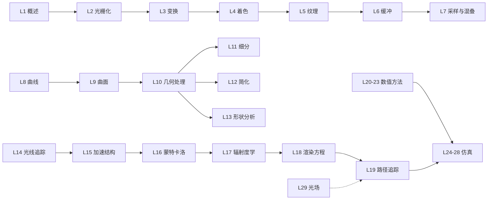

> 本文整理自 CMU 15-462/662《Computer Graphics》(Keenan Crane 主讲) 完整课程，按讲义粒度收录**每一讲的算法与公式**。记号约定：向量用粗体，矩阵用大写字母，$\theta$ 指角度、$\omega$ 指立体角方向。建议对照讲义使用：算法看流程，公式记推导，最后动手实现。

## 课程全景

路线：**光栅化（怎么画）→ 几何（画什么）→ 光线追踪（光怎么算）→ 数值方法（怎么算得准）→ 仿真（怎么动起来）**。下列编号为官方 Lecture 编号。

---

## 一、光栅化 Rasterization（L1–L2、L6）

**问题**：给定三角形，确定它覆盖哪些像素并着色。

### 1.1 成像模型

针孔相机：光线从场景穿过小孔打到感光面。像素 $p = (x, y)$ 与场景方向一一对应。图形学管线：顶点 → 变换到裁剪/NDC 空间 → 光栅化 → 片元着色 → 帧缓冲。

### 1.2 屏幕坐标与像素约定

- 像素中心在 $(x + 0.5, y + 0.5)$（半整数偏移）
- 视口变换（NDC $[-1,1]^2$ → 屏幕 $[0,W]\times[0,H]$）：

$$x_{screen} = \frac{(x_{ndc} + 1)}{2} \cdot W, \qquad y_{screen} = \frac{(y_{ndc} + 1)}{2} \cdot H$$

### 1.3 重心坐标（Barycentric Coordinates）

三角形内任一点唯一表示为三顶点加权和：

$$p = \alpha a + \beta b + \gamma c, \qquad \alpha + \beta + \gamma = 1$$

- 内部判据：$\alpha, \beta, \gamma \ge 0$
- 面积比定义：$\alpha = \dfrac{A_{pbc}}{A_{abc}}$（$p$ 与顶点 $a$ 对边围成的子三角形面积比）
- 解析解（用叉积表示，$\|(b-a)\times(c-a)\|$ 为三角形面积两倍）：

$$\alpha = \frac{(c - b) \times (p - b)}{(c - b) \times (a - b)}, \qquad
\beta = \frac{(a - c) \times (p - c)}{(a - c) \times (b - c)}, \qquad
\gamma = 1 - \alpha - \beta$$

- 用途：线性插值颜色、法线、UV、深度等顶点属性（透视校正后）

### 1.4 边函数（Edge Function）

有向边 $(a \to b)$：

$$E_{ab}(p) = (b_x - a_x)(p_y - a_y) - (b_y - a_y)(p_x - a_x)$$

- $E > 0$：$p$ 在左侧；三角形内部 = 三边同号（顺时针取反号）
- 与重心坐标的关系：$E_{ab}(p) = \gamma \cdot E_{ab}(c)$ 等——边函数归一化就是重心坐标
- **增量计算**：相邻像素 $\Delta E = E_{ab}(p + (1,0)) - E_{ab}(p) = (b_y - a_y)$，一个加法/像素，GPU 光栅化基础

### 1.5 覆盖测试与遍历

- **逐像素测试**：遍历三角形包围盒 $[x_{\min}, x_{\max}] \times [y_{\min}, y_{\max}]$，对每像素算三条边函数
- **扫描线**：每行求边交点 $(x_l, x_r)$，填充区间
- 光栅化输出片元（fragment）：像素位置 + 插值属性

### 1.6 透视校正插值（关键推导）

屏幕空间深度 $z$ 不是线性插值的（透视投影把直线映射为直线，但深度方向被压缩）。推导：3D 点 $p = a + t(b - a)$ 投影到屏幕后，插值参数 $t$ 与屏幕坐标不成线性。

正确做法：对 $\frac{1}{z}$ 做线性插值：

$$z(p) = \frac{1}{\frac{\alpha}{z_a} + \frac{\beta}{z_b} + \frac{\gamma}{z_c}}$$

对任意属性 $f$（颜色/UV/法线）：

$$f(p) = \frac{\frac{\alpha f_a}{z_a} + \frac{\beta f_b}{z_b} + \frac{\gamma f_c}{z_c}}{\frac{\alpha}{z_a} + \frac{\beta}{z_b} + \frac{\gamma}{z_c}}$$

即：**先除以 $z$ 插值，再乘回 $z$**（除以 $w$ 同理，GPU 硬件就是按 $w$ 做的）。

### 1.7 Z-Buffer（深度缓冲）

$$\text{if } z_{new} < z_{buf}[x][y]: \quad \text{写入颜色、更新深度}$$

- 与绘制顺序无关；$O(1)$ 每像素
- 深度精度问题：早期 Z-buffer 用 $z_{ndc} \in [-1,1]$，近处精度差；用**反 Z**（$1/z$ 存储）或对数深度缓解
- 与画家算法对比：画家算法深度排序 $O(n \log n)$ 且多边形穿插会失败

### 1.8 采样与混叠（L7）

- 走样 = 采样率低于信号频率。一维采样理论：$f_s > 2 f_{\max}$（奈奎斯特）
- 采样 = 信号 × 脉冲梳 $\Pi \cdot s(x) = \sum_k f(k\Delta)$；频域 = 频谱的周期复制
- 重建 = 与 sinc 卷积（低通）；实际用盒子/线性/高斯滤波（各有振铃/模糊取舍）
- 常见走样：锯齿（几何边缘）、摩尔纹（纹理/重复图案）、车轮效应（时间采样）
- 反走样手段：
  - **MSAA**：每像素 2/4/8 个子采样点，只对覆盖掩码超采样，片元着色一次（成本远低于 SSAA）
  - **SSAA**：高分辨率渲染后降采样
  - **抖动（Jittering）**：规则采样 + 随机偏移 → 混叠变噪声
  - **Mipmap/各向异性过滤**：纹理域的预滤波

### 1.9 经典算法（历史）

- **Bresenham 画线**：纯整数，误差项 $e \leftarrow e + \Delta y$，$e > \Delta x$ 时走对角步
- **扫描线多边形填充**：每行求交点、奇偶规则配对
- **DDA**：浮点增量步进画线

---

## 二、变换 Transforms（L3）

**问题**：模型空间 → 世界 → 视图 → 裁剪/NDC → 屏幕。

### 2.1 齐次坐标

$$p = \begin{pmatrix} x \\ y \\ z \\ 1 \end{pmatrix}, \qquad (x, y, z, w) \equiv \left(\frac{x}{w}, \frac{y}{w}, \frac{z}{w}\right)$$

- 优点：平移变线性、透视投影变线性、复合 = 矩阵乘法
- 仿射矩阵：$M = \begin{bmatrix} A & t \\ 0^T & 1 \end{bmatrix}$

### 2.2 2D 变换

旋转 $\theta$、缩放 $(s_x, s_y)$、剪切（沿 $x$：$x' = x + a y$）：

$$R = \begin{bmatrix} \cos\theta & -\sin\theta \\ \sin\theta & \cos\theta \end{bmatrix}, \quad
S = \begin{bmatrix} s_x & 0 \\ 0 & s_y \end{bmatrix}, \quad
H_x = \begin{bmatrix} 1 & a \\ 0 & 1 \end{bmatrix}$$

绕任意点 $p$ 旋转 = 平移 $-p$ → 旋转 → 平移 $p$。

### 2.3 3D 旋转矩阵

绕 $x/y/z$ 轴：

$$R_x = \begin{bmatrix} 1 & 0 & 0 \\ 0 & \cos\theta & -\sin\theta \\ 0 & \sin\theta & \cos\theta \end{bmatrix}, \quad
R_y = \begin{bmatrix} \cos\theta & 0 & \sin\theta \\ 0 & 1 & 0 \\ -\sin\theta & 0 & \cos\theta \end{bmatrix}, \quad
R_z = \begin{bmatrix} \cos\theta & -\sin\theta & 0 \\ \sin\theta & \cos\theta & 0 \\ 0 & 0 & 1 \end{bmatrix}$$

**Rodrigues 公式**（绕单位轴 $k$）：

$$R = I\cos\theta + [k]_\times \sin\theta + kk^T(1-\cos\theta), \qquad v' = v\cos\theta + (k\times v)\sin\theta + k(k\cdot v)(1-\cos\theta)$$

其中 $[k]_\times$ 是叉积矩阵。

### 2.4 变换的分类与复合

| 变换 | 自由度 | 保持 |
|---|---|---|
| 平移/旋转（刚体） | 3/3 | 距离、角度 |
| 等距 | 6 | 距离、角度 |
| 相似（含缩放） | 7 | 角度、比例 |
| 仿射 | 12 | 平行性 |
| 射影（含透视） | 15 | 共线性、交比 |

复合顺序从右往左读：$M = T \cdot R \cdot S$，先缩放再旋转再平移。

### 2.5 视图矩阵（LookAt）

相机位置 $e$、目标 $c$、上向量 $u$：

$$g = \frac{c - e}{\|c - e\|}, \quad w = \frac{g \times u}{\|g \times u\|}, \quad t = w \times g$$

$$V = \begin{bmatrix} w_x & w_y & w_z & -w\cdot e \\ t_x & t_y & t_z & -t\cdot e \\ -g_x & -g_y & -g_z & g\cdot e \\ 0 & 0 & 0 & 1 \end{bmatrix}$$

### 2.6 投影矩阵（推导）

**正交**：先平移中心到原点再缩放：$M_{ortho} = S \cdot T$。

**透视**：把视锥体（frustum）挤压成长方体再做正交。核心关系（相似三角形）：

$$x' = \frac{n}{-z} x, \qquad y' = \frac{n}{-z} y$$

（$z$ 为负表示在相机前方，$n$ 为近平面距离。）令 $w' = -z$ 再除以 $w$：

$$M_{persp} = \begin{bmatrix} n & 0 & 0 & 0 \\ 0 & n & 0 & 0 \\ 0 & 0 & n+f & -fn \\ 0 & 0 & 1 & 0 \end{bmatrix}
\quad \text{（对称视锥体，除以 } w \text{ 后）}$$

OpenGL 完整版（非对称视锥体 $l, r, b, t$，深度映射到 $[-1,1]$）：

$$M_{persp} = \begin{bmatrix} \frac{2n}{r-l} & 0 & \frac{r+l}{r-l} & 0 \\ 0 & \frac{2n}{t-b} & \frac{t+b}{t-b} & 0 \\ 0 & 0 & -\frac{f+n}{f-n} & -\frac{2fn}{f-n} \\ 0 & 0 & -1 & 0 \end{bmatrix}$$

注意：**透视除法在光栅化阶段按 $w$ 插值**（对应 1.6 透视校正）。焦距 $f$ 与视角 $\alpha$ 关系：$f = \frac{H/2}{\tan(\alpha/2)}$。

### 2.7 四元数（Quaternions）

- 单位四元数 $q = (\cos\frac{\theta}{2}, \sin\frac{\theta}{2}\hat{u})$ 表示绕 $\hat{u}$ 转 $\theta$
- 旋转：$v' = q\,v\,q^{-1}$；复合：$q_{total} = q_2 q_1$；逆：$q^{-1} = \frac{\bar q}{\|q\|^2}$
- 旋转矩阵 ↔ 四元数互转（矩阵版：$R = I + 2s[v]_\times + 2[v]_\times^2$，$v$ 为虚部、$s$ 为实部）
- **Slerp**（单位球面最短弧插值）：

$$\text{slerp}(q_1, q_2, t) = \frac{\sin((1-t)\Omega)\,q_1 + \sin(t\Omega)\,q_2}{\sin\Omega}, \qquad \Omega = \arccos(q_1 \cdot q_2)$$

- 为什么用四元数：无万向锁、内存小、插值自然（对比欧拉角的 gimbal lock）

---

## 三、曲线与曲面 Curves & Surfaces（L8–L9）

**问题**：控制点 → 光滑曲线/曲面，高效求值、求导、细分。

### 3.1 Bezier 曲线

**Bernstein 基**（$n$ 次）：

$$B_i^n(t) = \binom{n}{i} t^i (1-t)^{n-i}, \qquad \sum_i B_i^n(t) = 1, \quad B_i^n(t) \ge 0 \ (t \in [0,1])$$

曲线：$B(t) = \sum_{i=0}^{n} B_i^n(t) P_i$

**de Casteljau 算法**（递归线性插值，$O(n^2)$）：

$$P_i^{(k)} = (1-t) P_i^{(k-1)} + t P_{i+1}^{(k-1)}, \qquad P_i^{(0)} = P_i, \quad B(t) = P_0^{(n)}$$

**性质**：
- 端点插值：$B(0) = P_0, B(1) = P_n$；端切线：$B'(0) = n(P_1 - P_0)$
- 凸包性质、变差缩减性质（曲线摆动次数 ≤ 控制多边形）
- 仿射不变性（先变换后求值 = 先求值后变换）

**导数（hodograph）**：

$$B'(t) = n \sum_{i=0}^{n-1} B_i^{n-1}(t)\,(P_{i+1} - P_i)$$

**矩阵形式**（三次）：$B(t) = \begin{bmatrix} 1 & t & t^2 & t^3 \end{bmatrix} \begin{bmatrix} 1 & 0 & 0 & 0 \\ -3 & 3 & 0 & 0 \\ 3 & -6 & 3 & 0 \\ -1 & 3 & -3 & 1 \end{bmatrix} \begin{bmatrix} P_0 \\ P_1 \\ P_2 \\ P_3 \end{bmatrix}$

**升阶（degree elevation）**：$n$ 次 Bezier 可写成 $n+1$ 次，新控制点 $Q_i = \frac{i}{n+1}P_{i-1} + (1 - \frac{i}{n+1})P_i$（细化能力）

**细分（割角）**：$t = \frac{1}{2}$ 处切成两段，各自控制点为 de Casteljau 三角的边界元素

### 3.2 B-spline 与 NURBS

**Cox–de Boor 递推**（$i$ 为控制点序号，$k$ 为阶数，$t$ 在节点向量 $[t_0, t_1, \dots]$ 上）：

$$N_i^1(t) = \begin{cases} 1 & t_i \le t < t_{i+1} \\ 0 & \text{otherwise} \end{cases}$$

$$N_i^k(t) = \frac{t - t_i}{t_{i+k-1} - t_i} N_i^{k-1}(t) + \frac{t_{i+k} - t}{t_{i+k} - t_{i+1}} N_{i+1}^{k-1}(t)$$

- 局部支撑：移动一个控制点只影响局部
- **NURBS**：$B(t) = \frac{\sum N_i^k(t) w_i P_i}{\sum N_i^k(t) w_i}$，权重 $w_i$ 可精确表示圆/圆锥

**连续性**：$C^0$ 位置连续、$C^1$ 切线连续、$C^2$ 曲率连续；Bezier 拼接处 $C^1$ 条件：$P_2, P_3(=Q_0), Q_1$ 共线且比例 $\frac{|P_3 - P_2|}{|Q_1 - Q_0|}$ 恒定

### 3.3 Catmull-Rom（过点插值）

给定点 $P_{i-1}, P_i, P_{i+1}, P_{i+2}$，段内：

$$B(t) = \frac{1}{2} \begin{bmatrix} 1 & t & t^2 & t^3 \end{bmatrix} \begin{bmatrix} 0 & 2 & 0 & 0 \\ -1 & 0 & 1 & 0 \\ 2 & -5 & 4 & -1 \\ -1 & 3 & -3 & 1 \end{bmatrix} \begin{bmatrix} P_{i-1} \\ P_i \\ P_{i+1} \\ P_{i+2} \end{bmatrix}$$

曲线穿过 $P_i, P_{i+1}$，切线 $B'(0) = \frac{P_{i+1} - P_{i-1}}{2}$。

### 3.4 Bezier 曲面（张量积）

$$S(u, v) = \sum_{i=0}^{n} \sum_{j=0}^{m} B_i^n(u)\, B_j^m(v)\, P_{ij}$$

- 求值：先按 $u$ 对每行求曲线，再按 $v$ 对结果求曲线
- 偏导：$\frac{\partial S}{\partial u} = \sum_{ij} \dot{B}_i^n(u) B_j^m(v) P_{ij}$
- 法线：$n = \frac{\partial S}{\partial u} \times \frac{\partial S}{\partial v}$（归一化）
- 旋转曲面：母线绕轴旋转；扫掠曲面：剖面沿路径

### 3.5 细分曲面（L11）

**Chaikin 割角**（1D）：$q_{2i} = \frac{3}{4}P_i + \frac{1}{4}P_{i+1}$，$q_{2i+1} = \frac{1}{4}P_i + \frac{3}{4}P_{i+1}$ → 二次 B-spline

**Loop 细分**（三角形网格）：
- 边点：$E = \frac{3}{8}(v_1 + v_2) + \frac{1}{8}(v_3 + v_4)$（两端点 + 对侧两顶点）
- 顶点（$n$ 价）：$v' = (1 - n\beta)v + \beta \sum_{j} v_j$，$\beta = \dfrac{1}{n}\left[\dfrac{5}{8} - \left(\dfrac{3}{8} + \dfrac{1}{4}\cos\dfrac{2\pi}{n}\right)^2\right]$
- 极限位置：$v_\infty = \frac{3}{8 + 5n}\sum v_j$（特征分析得到）

**Catmull-Clark**（四边形/任意网格）：
- 面点：$F = \text{面顶点平均}$
- 边点：$E = \frac{1}{4}(v_1 + v_2 + F_1 + F_2)$
- 顶点：$v' = \dfrac{Q}{n} + \dfrac{2R}{n} + \dfrac{(n-3)S}{n}$（$Q$=相邻面点均值，$R$=相邻边点均值，$S$=原顶点，$n$=价）
- 收敛性：规则点（四边形 $n=4$）处 $C^2$；奇异点处 $C^1$

**特征分析**：细分本质是线性算子，收敛速度与细分矩阵的特征值 $\lambda$ 有关，$\lambda_1 = 1$（位置）、$|\lambda_2| = |\lambda_3|$（切平面）、次大特征值决定连续性。

---

## 四、几何处理 Geometry Processing（L10–L13）

**问题**：网格的表示、平滑、简化、参数化、形状分析。

### 4.1 网格基础

- 欧拉公式（亏格 $g$ 的闭流形）：$V - E + F = 2 - 2g$
- 流形（manifold）条件：每条边被 1 或 2 个面共享；顶点 1-环邻域同胚于圆盘或半圆盘（边界）
- 平均价：三角网格约为 6（每个三角形 3 条边，每条边 2 个面共享）
- **半边结构（Half-Edge）**：每条无向边拆两条有向半边，指针 `next / prev / twin / vertex`；$O(1)$ 遍历邻居、$O(1)$ 局部编辑
- 其他表示：邻接表/矩阵（存图论算法）、面表（紧凑）

### 4.2 局部编辑操作

- **Flip（翻转边）**：改对角线；合法性 = 四边形凸 + 无退化；**Delaunay 性质**：空圆（外接圆不含其他点），翻转使最小角最大化、最大化最小角度
- **Split（分裂边）**：中点插顶点，4 个三角形 → 2 个三角形
- **Collapse（坍缩边）**：合并两端点；**link 条件**：被移除顶点 1-环必须保持闭合圆盘，否则出现非流形（纽结/孔）
- 鲁棒性：浮点精度下要检查退化（面积为零、共线）

### 4.3 拉普拉斯算子与平滑

**余切拉普拉斯（cotangent Laplacian）**——离散 Laplace–Beltrami：

$$\Delta f_i = \frac{1}{2A_i} \sum_{j \in N(i)} (\cot \alpha_{ij} + \cot \beta_{ij})\,(f_j - f_i)$$

- $\alpha_{ij}, \beta_{ij}$：边 $(i,j)$ 对角的两个角；$A_i$：顶点邻域 Voronoi 面积（或 $\frac{1}{3}$ 邻域三角形面积和）
- 矩阵形式 $\mathbf{L}$（对称、半正定、行和为零）→ 泊松方程 $\mathbf{L}u = f$ 可解

**Laplacian 平滑（热传导）**：$\frac{\partial x}{\partial t} = \Delta x$
- 显式：$x_{k+1} = x_k + h\mathbf{L}x_k$——稳定条件 $h < \frac{2}{\lambda_{max}}$，网格细密时步长极小
- **隐式**：$(\mathbf{I} - h\mathbf{L})\, x_{k+1} = x_k$——无条件稳定，解稀疏线性系统（CG）

**平均曲率流**：$\frac{\partial x}{\partial t} = H\,n = \frac{1}{2}\Delta x$——曲面按平均曲率方向收缩，可用于去噪/光滑化/形状演化

### 4.4 网格简化：QEM（Quadric Error Metrics）

**二次误差度量**——坍缩代价 = 顶点到邻接平面的距离平方和：

$$Q(v) = \sum_{p \in \text{planes}(v)} (n_p^T v + d_p)^2
= v^T \underbrace{\left(\sum_p n_p n_p^T\right)}_{A} v + 2\underbrace{\left(\sum_p d_p n_p\right)}_{b}^T v + \underbrace{\sum_p d_p^2}_{c}$$

- 用 $4\times4$ 矩阵 $\tilde{Q} = \begin{bmatrix} A & b \\ b^T & c \end{bmatrix}$ 表示，坍缩两顶点时 $\tilde{Q} = \tilde{Q}_1 + \tilde{Q}_2$
- 最优新位置：$\nabla Q = 0 \Rightarrow v^* = -A^{-1}b$（$A$ 奇异则取边中点）
- 算法：所有边入堆 → 反复弹最小代价边 → 坍缩 → 更新邻接边的代价；贪心但效果极好，生成任意 LOD
- 对比：顶点聚类（快但质量差）、增量坍缩（质量好）

### 4.5 参数化（Parameterization）

**Tutte 嵌入**：固定边界到凸多边形，内部顶点满足加权拉普拉斯：

$$\sum_{j \in N(i)} w_{ij}\,(u_j - u_i) = 0$$

- 定理（Tutte 1963）：若 $w_{ij} > 0$ 且边界凸，解是**单射**（无三角形翻转）
- 常用权重：均匀 $w_{ij} = 1$、余切 $w_{ij} = \cot\alpha + \cot\beta$（保角更好）

**LSCM（最小二乘保角）**：最小化共形能量 $\sum_T \|J - R\|_F^2$（雅可比偏离旋转的程度），化为稀疏线性最小二乘

**ARAP（尽量刚性）**：迭代交替优化局部旋转 $R_i$ 与全局位置：

$$E(u) = \sum_{e_{ij}} w_{ij} \|(u_i - u_j) - R_i(v_i - v_j)\|^2$$

- 局部步骤：每顶点的最优 $R_i$ 由 SVD 得到；全局步骤：解线性系统
- 保形参数化适合贴图；ARAP 适合大变形、展平接近等距

### 4.6 形状分析（L13）

- **离散高斯曲率**（角亏）：$K_i = \dfrac{2\pi - \sum_{j} \theta_{ij}}{A_i}$（内部顶点）；边界顶点用 $\pi - \sum\theta$
- **离散平均曲率**：$\|H n\| = \frac{1}{2}\|\Delta x\|$（对坐标逐分量应用 Laplacian）
- 主曲率：$\kappa_{1,2} = H \pm \sqrt{H^2 - K}$
- **热方法（热测地线）**：
  1. 解热方程 $\Delta u = \delta_p$（或短时扩散）
  2. 归一化梯度场 $X = -\frac{\nabla u}{\|\nabla u\|}$
  3. 解泊松方程 $\Delta d = \nabla \cdot X$，$d$ 即近似测地距离
- **拉普拉斯特征向量**（谱分析）：$\mathbf{L}\phi = \lambda \phi$；前几个特征向量编码全局形状（形状匹配、分割、降维）

---

## 五、光线追踪 Ray Tracing（L14–L15）

**问题**：每像素发射光线找最近交点，递归计算光照。

### 5.1 射线生成

- 相机：位置 $e$、基 $(u, v, w)$、fov；屏幕像素 $(x, y)$ → 射线方向
- 透视：$d \propto x u + y v - f w$（$f$ 焦距）；正交：$d = -w$ 恒定
- 射线参数化：$r(t) = o + t d$，$t > 0$（$t$ 是距离参数）

### 5.2 求交

**射线-球**：$|o + td - c|^2 = R^2 \Rightarrow t^2(d\cdot d) + 2t\,d\cdot(o-c) + |o-c|^2 - R^2 = 0$

判别式 $\Delta = b^2 - ac$（约化形式）；$\Delta < 0$ 无交点；取最小正根；法线 $n = \frac{p - c}{R}$。

**射线-平面**：$t = \dfrac{(p_0 - o)\cdot n}{d \cdot n}$（$d \cdot n \ne 0$；分子/分母同号才取）

**射线-三角形（Möller–Trumbore）**：解 $o + td = (1-\alpha-\beta)a + \alpha b + \beta c$

$$[ -d,\quad b-a,\quad c-a ] \begin{bmatrix} t \\ \alpha \\ \beta \end{bmatrix} = o - a$$

（克拉默法则一步解出；判定 $t > 0$，$\alpha,\beta \ge 0$，$\alpha+\beta \le 1$；无需求平面法线，数值稳定）

**射线-AABB（slab 法）**：每轴求区间 $t_{min}^i = \frac{p_{min}^i - o_i}{d_i}$，$t_{max}^i = \frac{p_{max}^i - o_i}{d_i}$；交区间 $t_{enter} = \max_i t_{min}^i$，$t_{exit} = \min_i t_{max}^i$；命中当 $t_{enter} \le t_{exit}$ 且 $t_{exit} > 0$

### 5.3 加速结构（L15）

**均匀网格**：空间切 $n_x \times n_y \times n_z$，DDA 步进遍历——适合均匀场景；分辨率选择影响性能

**BVH（包围体层次）**：
- 构造（top-down）：选最长轴 → 中位数划分（$O(n\log n)$）或 SAH 划分
- 遍历：栈式递归，先近后远（正面命中）；$O(\log n)$ 平均
- 叶节点包小图元集；不需要空间均匀

**SAH（表面积启发式）**：估计遍历+求交代价，选择划分点：

$$C = C_t + \frac{A_L}{A} N_L C_i + \frac{A_R}{A} N_R C_i$$

- $C_t$：遍历开销，$C_i$：求交开销，$A$：节点表面积，$N$：图元数
- 贪心：沿最长轴扫描 $O(n\log n)$ 个候选划分点

**KD-tree**：轴对齐空间二分（沿节点轴切空间而非图元集合），经典加速结构

**其他**：八叉树（自适应网格）、层次网格、表面划分（考虑缓存）

### 5.4 反射、折射、菲涅尔

**反射**：$r = d - 2(d \cdot n)n$

**Snell 折射**：$\eta_i \sin\theta_i = \eta_t \sin\theta_t$（$\eta$ 为折射率）

$$t = \frac{\eta_i}{\eta_t}\left(d - (d\cdot n)n\right) - n\sqrt{1 - \left(\frac{\eta_i}{\eta_t}\right)^2\left(1 - (d\cdot n)^2\right)}$$

- 根号内 $< 0$ → 全内反射（只反射，用于光纤/水中视角）
- 临界角：$\sin\theta_c = \frac{\eta_t}{\eta_i}$

**Schlick 菲涅尔近似**：

$$R(\theta) = R_0 + (1 - R_0)(1 - \cos\theta)^5, \qquad R_0 = \left(\frac{\eta_1 - \eta_2}{\eta_1 + \eta_2}\right)^2$$

- $\theta = 0$ 时 $R = R_0$（垂直入射），掠射角 $\to 1$
- 完整 Fresnel 方程分 S/P 偏振，图形学一般用 Schlick

### 5.5 阴影与光照

- 阴影射线：从交点向光源发射，被遮挡则贡献为 0
- 软阴影：面光源多采样点 + 可见性积分
- 递归光线追踪：交点处继续发反射/折射射线（Whitted 风格）

---

## 六、纹理与着色 Texture & Shading（L4–L5）

### 6.1 着色模型

**Blinn-Phong**（半程向量）：

$$L = k_a + k_d\,(L \cdot N) + k_s\,(H \cdot N)^\alpha, \qquad H = \frac{L + V}{\|L + V\|}$$

- 分量：环境 $k_a$（近似间接光）、漫反射 $k_d(L\cdot N)$（Lambert 定律：光强 ∝ $\cos\theta$）、镜面 $k_s(H\cdot N)^\alpha$（高光）
- Gouraud vs Phong：顶点着色插值 vs 法线插值逐像素着色——Phong 高光更尖锐正确，成本更高
- 光源：方向光（$L$ 恒定）、点光（衰减 $\propto \frac{1}{r^2}$）、聚光灯（角衰减）

### 6.2 微表面模型（Cook-Torrance 类）

$$f_r = \frac{D(h)\,F(\theta)\,G(l, v)}{4\,(n\cdot l)(n\cdot v)}$$

- $D$ 法线分布（GGX/Trowbridge-Reitz）：$D(h) = \dfrac{\alpha^2}{\pi\left((n\cdot h)^2(\alpha^2 - 1) + 1\right)^2}$
- $F$ 菲涅尔（Schlick）；$G$ 几何遮蔽-阴影（Smith：$G = \frac{2(n\cdot l)(n\cdot v)}{(n\cdot v)\sqrt{...}+(n\cdot l)\sqrt{...}}$ 形式）
- 能量守恒、各向同性/各向异性变体

### 6.3 纹理映射

- 纹理坐标 $(u, v) \in [0,1]^2$ 通过重心坐标插值（**透视校正**）
- **最近邻**：$f(u,v) = f_{[\lfloor u W \rfloor, \lfloor v H \rfloor]}$——放大锯齿、缩小混叠
- **双线性**：$f(u,v) = (1-s)(1-t)f_{00} + s(1-t)f_{10} + (1-s)t f_{01} + st f_{11}$
- **Mipmap**：预生成金字塔（每层降采样 1/2）；层号 = 像素足迹尺度：

$$d = \log_2 \max\left(\left|\frac{du}{dx}\right|, \left|\frac{dv}{dx}\right|\right)$$

- **三线性**：两层双线性 + 层间 $\alpha$ 混合（消除层间跳变）
- **各向异性过滤**：足迹是椭圆而非圆时按长短轴分别采样，消除斜视角模糊
- 纹理坐标生成：平面/球面/圆柱投影、立方体环境映射、程序化纹理（Perlin 噪声 $noise(x)$）
- 变形技术：**凹凸贴图**（扰动物理表面法线，不改变轮廓）、**法线贴图**（存切线空间法线）、**位移贴图**（真位移几何）

---

## 七、辐射度学 Radiometry（L17）

**问题**：物理上定义光，为渲染方程奠基。

### 7.1 单位体系

| 量 | 符号 | 定义 | 单位 |
|---|---|---|---|
| 辐射通量 | $\Phi$ | 能量/时间 | W |
| 辐照度 | $E$ | $\frac{d\Phi}{dA}$（单位面积入射） | W/m² |
| 辐射强度 | $I$ | $\frac{d\Phi}{d\omega}$（单位立体角） | W/sr |
| 辐射度 | $L$ | $\frac{d^2\Phi}{dA^\perp d\omega}$（单位投影面积×立体角） | W/(m²·sr) |

- 立体角：$d\omega = \frac{dA\cos\theta}{r^2}$；球面 $4\pi$ sr、半球 $2\pi$ sr
- 关键性质：**辐射度 $L$ 沿射线传播不变**（真空中无衰减）——渲染方程好算的原因
- 辐照度 = 辐射度余弦加权积分：$E = \int_\Omega L_i \cos\theta\, d\omega$
- 光谱：$L(\lambda)$ 随波长变化；颜色 = 与视锥细胞响应函数积分

### 7.2 BRDF

$$f_r(\omega_i, \omega_o) = \frac{dL_o(\omega_o)}{dE_i(\omega_i)} = \frac{dL_o}{L_i \cos\theta_i\, d\omega_i}$$

- 性质：互易性 $f_r(\omega_i,\omega_o) = f_r(\omega_o,\omega_i)$（Helmholtz）；能量守恒 $\int_\Omega f_r \cos\theta\, d\omega \le 1$
- 各向同性 BRDF 只依赖相对方位角 $\phi$
- Lambert：$f_r = \frac{\rho_d}{\pi}$（$\rho_d$ 反照率，除以 $\pi$ 因半球积分 $\int_\Omega \cos\theta d\omega = \pi$）
- 一般化：BSDF = BRDF（反射）+ BTDF（透射）

---

## 八、渲染方程与路径追踪（L18–L19）

### 8.1 渲染方程

$$L_o(x, \omega_o) = L_e(x, \omega_o) + \int_{\Omega} f_r(x, \omega_i, \omega_o)\, L_i(x, \omega_i)\, (\omega_i \cdot n)\, d\omega_i$$

- $L_e$：自发光；积分：所有入射方向的光经 BRDF 反射
- 算子形式：$L = E + T L$（$T$ 为传输算子），形式解 $L = (I - T)^{-1}E = \sum_{k=0}^\infty T^k E$（**Neumann 级数** = 0 次弹射 + 1 次 + 2 次…）
- 从渲染方程看：光栅化 = 直接光 + 解析近似；路径追踪 = 完整数值解

### 8.2 蒙特卡洛（L16）

**随机变量基础**：PDF $p(x)$（$\int p = 1$）、CDF $F(x) = \int_{-\infty}^x p$；期望 $\mathbb{E}[f] = \int fp$；方差 $\text{Var} = \mathbb{E}[(f - \mathbb{E}f)^2]$

**MC 估计器**：

$$\langle F \rangle = \frac{1}{N}\sum_{i=1}^N \frac{f(x_i)}{p(x_i)}, \qquad \mathbb{E}[\langle F\rangle] = \int f\, dx \ (\text{无偏})$$

- 方差：$\text{Var}[\langle F\rangle] = \frac{1}{N}\left(\mathbb{E}[g^2] - \mathbb{E}[g]^2\right)$，$g = \frac{f}{p}$；收敛 $\frac{1}{\sqrt{N}}$
- 误差 = 偏差（bias）+ 方差（variance）：有偏但低方差常是实际选择（如去噪）

**采样方法**：
- **逆变换采样**：$x = F^{-1}(\xi)$，$\xi \sim U[0,1]$。例：指数分布 $x = -\ln(1-\xi)$
- **拒绝采样**：从简单分布采样，按 $\frac{f}{Mp}$ 概率接受（高维效率差）
- 球面均匀：$\theta = \arccos(1-2\xi_1)$，$\phi = 2\pi\xi_2$
- **余弦加权半球**（对应 $\cos\theta$ 项，Lambert 最优）：

$$\theta = \arccos\sqrt{\xi_1}, \qquad \phi = 2\pi \xi_2, \qquad p(\omega) = \frac{\cos\theta}{\pi}$$

- **分层采样**：$[0,1]^2$ 分 $k\times k$ 格，每格一采样——无空隙、方差更低
- **低差异序列**（Halton/Sobol）：确定性"均匀"序列，收敛 $O(\frac{\log N}{N})$
- **重要性采样**：$p \propto f$ 方差最小（$p = \frac{f}{\int f}$ 时方差为零）；实际取 BRDF 或光源的近似分布

### 8.3 路径追踪

递归 MC 渲染方程：

$$L_o \approx L_e + \frac{f_r(x, \omega_i, \omega_o)\, L_i(x, \omega_i)\, \cos\theta_i}{p(\omega_i)}$$

- **直接 + 间接分离**：直接光（光源采样，MIS 融合 BRDF 采样）方差小；间接光（BRDF 采样递归）方差大
- **俄罗斯轮盘赌**（截断递归保持无偏）：

$$L \approx \begin{cases} \dfrac{f_r\, L_i \cos\theta}{p(\omega)\, p_{cont}} & \text{概率 } p_{cont} \\ 0 & \text{否则} \end{cases}$$

- **MIS（多重要性采样）**，balance heuristic：

$$w_i(x) = \frac{p_i^2(x)}{\sum_j p_j^2(x)}, \qquad F = \sum_i \frac{1}{N_i}\sum_{j} \frac{f(x_{ij})\, w_i(x_{ij})}{p_i(x_{ij})}$$

- 焦散（caustics）：高方差难点，需光子映射/双向路径追踪/MLT
- 去噪：保持几何的滤波（NLM、SVGF、OIDN）——用 albedo/法线引导
- 参考解法：双向路径追踪（BDPT）、Metropolis 光照传输（MLT）、光子映射——均基于渲染方程的 Neumann 级数

---

## 九、数值方法 Numerical Methods（L20–L23）

**问题**：图形学的底层是"解方程"——积分、微分、线性系统、优化、特征值。

### 9.1 数值积分

| 方法 | 公式 | 误差 |
|---|---|---|
| 中点 | $\int_a^b f \approx (b-a)\, f\left(\frac{a+b}{2}\right)$ | $O(h^2)$ |
| 梯形 | $\approx \frac{b-a}{2}\left(f(a) + f(b)\right)$ | $O(h^2)$ |
| Simpson | $\approx \frac{b-a}{6}\left(f(a) + 4f\left(\frac{a+b}{2}\right) + f(b)\right)$ | $O(h^4)$ |
| 复合（分 $n$ 段） | 逐段求和 | 随 $n$ 提高 |
| 蒙特卡洛 | $\frac{1}{N}\sum \frac{f(x_i)}{p(x_i)}$ | $O(\frac{1}{\sqrt{N}})$ |

高维（渲染 $\sim 10^6$ 维积分）只有蒙特卡洛可行——确定性方法受维度灾难限制。

### 9.2 有限差分

$$f'(x) = \frac{f(x+h) - f(x)}{h} + O(h) \quad (\text{前向})$$

$$f'(x) = \frac{f(x+h) - f(x-h)}{2h} + O(h^2) \quad (\text{中心})$$

$$f''(x) = \frac{f(x+h) - 2f(x) + f(x-h)}{h^2} + O(h^2)$$

梯度 $\nabla f = (\partial_x f, \partial_y f, \partial_z f)$；散度 $\nabla \cdot v = \sum \partial_i v_i$；旋度 $\nabla \times v$；拉普拉斯 $\Delta f = \nabla \cdot \nabla f = \sum \partial_{ii} f$

### 9.3 线性系统

- **LU 分解**：$A = LU$ 直接解 $O(n^3)$（稠密小系统）
- **Cholesky**：$A = LL^T$（对称正定，$O(\frac{n^3}{6})$，两倍快）
- **Jacobi**：$x^{(k+1)} = D^{-1}(b - (L+U)x^{(k)})$——收敛慢但可并行
- **Gauss-Seidel**：$x_i^{(k+1)} = \frac{1}{a_{ii}}\left(b_i - \sum_{j<i} a_{ij}x_j^{(k+1)} - \sum_{j>i} a_{ij}x_j^{(k)}\right)$——立即用新值
- **共轭梯度（CG）**：对称正定下的最优 Krylov 方法；残差正交方向搜索，$O(n)$ 内存，每步矩阵-向量乘；预条件 CG（PCG）更快
- 应用：泊松方程 $\Delta u = f$、隐式积分 $(\mathbf{M} - h^2\mathbf{L})x = b$、参数化、光流
- 条件数 $\kappa = \frac{\lambda_{max}}{\lambda_{min}}$ 决定收敛速度——病态系统要预条件

### 9.4 最小二乘与特征值

**最小二乘**：$x^* = \arg\min_x \|Ax - b\|^2$：
- 法方程：$A^T A x = A^T b$（$A^T A$ 条件数平方，病态）
- **QR 分解**：$A = QR$，解 $Rx = Q^Tb$（数值稳定）
- **SVD**：$A = U\Sigma V^T$，$x = V\Sigma^{-1}U^T b$（最稳定，$A^TA$ 奇异时也能解）；伪逆 $A^+ = V\Sigma^{-1}U^T$

**特征值问题**：
- 幂法：$v_{k+1} = \frac{Av_k}{\|Av_k\|} \to$ 最大特征向量；反幂法求最小；位移幂法求中间
- QR 算法（对称情形）：迭代 $A_k = Q_k R_k, A_{k+1} = R_k Q_k$ 收敛到对角
- 应用：PCA（协方差矩阵特征向量）、拉普拉斯谱分析、应力张量

### 9.5 优化

- **梯度下降**：$x_{k+1} = x_k - \alpha \nabla f(x_k)$——线性收敛，步长 $\alpha$ 需线搜索；条件数差时之字形震荡
- **最速下降**：沿 $\nabla f$ 方向一维精确线搜索
- **牛顿法**：$x_{k+1} = x_k - H^{-1}(x_k)\nabla f(x_k)$——二次收敛，但每步解 Hessian；**拟牛顿（BFGS/L-BFGS）** 用梯度差近似 Hessian
- **随机梯度下降（SGD）**：用随机子集估计梯度——大规模机器学习标准
- **线搜索条件**：Armijo（$f(x + \alpha d) \le f(x) + c\alpha\nabla f\cdot d$）
- 约束优化：拉格朗日乘子 $\nabla f = \lambda \nabla g$；KKT 条件

---

## 十、仿真 Simulation（L24–L28）

**问题**：按物理规律让物体运动。核心：ODE/PDE 积分。

### 10.1 ODE 数值积分

对 $\dot{x} = f(x, t)$，步长 $h$：

| 方法 | 公式 | 稳定性 | 精度 |
|---|---|---|---|
| 显式欧拉 | $x_{k+1} = x_k + hf(x_k)$ | 条件稳定 | $O(h)$ |
| 隐式欧拉 | $x_{k+1} = x_k + hf(x_{k+1})$ | 无条件稳定 | $O(h)$ |
| 梯形/中点 | $x_{k+1} = x_k + \frac{h}{2}(f_k + f_{k+1})$ | 稳定 | $O(h^2)$ |
| RK2（中点法） | $x_{k+1} = x_k + hf(x_k + \frac{h}{2}f(x_k))$ | 条件 | $O(h^2)$ |
| RK4 | 4 次函数求值 | 条件 | $O(h^4)$ |

- 稳定性判据：线性测试 $\dot{x} = \lambda x$，显式欧拉要求 $|1 + \lambda h| < 1$；刚度比（最大/最小特征值）大 → 必须隐式
- **半隐式（symplectic）欧拉**：$v_{k+1} = v_k + h a(x_k)$，$x_{k+1} = x_k + h v_{k+1}$——保能量（长期稳定），游戏引擎标准
- 能量分析：显式欧拉注入能量（发散）、隐式欧拉耗散能量（衰减）、symplectic 保能量

### 10.2 弹簧-质点与布料

弹簧力（胡克 + 阻尼）：

$$F_{ij} = -k\left(\|x_i - x_j\| - l_0\right)\frac{x_i - x_j}{\|x_i - x_j\|} - c\,(v_i - v_j)$$

- 布料：弹簧网格（结构/剪切/弯曲）+ 隐式积分
- **隐式欧拉推导**（质量矩阵 $\mathbf{M}$，力雅可比 $\mathbf{J} = \frac{\partial f}{\partial x}$）：

$$(\mathbf{M} - h\mathbf{J} - h^2\mathbf{K})\,\Delta v = h(f + h\mathbf{J}v)$$

或常见形式：$(\mathbf{M} - h^2 \mathbf{L})\, x_{k+1} = \mathbf{M} x_k + h \mathbf{M} v_k + h^2 f$——稀疏 SPD 系统，CG 求解

- **约束求解**：罚函数（$F = -k\cdot$ 穿透深度）、拉格朗日乘子（解增广系统 $\begin{bmatrix} A & J^T \\ J & 0 \end{bmatrix}$）
- 碰撞处理：检测穿透 → 投影修正 + 摩擦（库仑摩擦 $F_f \le \mu F_n$）

### 10.3 刚体动力学

- 线动量/角动量：$F = m\dot v$，$\tau = \dot L$，$L = \mathbf{I}\omega$
- 体坐标系惯性张量 $\mathbf{I}$（对角化主轴）；世界系 $\mathbf{I}_{world} = R\,\mathbf{I}_{body}\,R^T$
- 欧拉方程：$\dot\omega = \mathbf{I}^{-1}(\tau - \omega \times \mathbf{I}\omega)$
- 姿态积分：$\dot q = \frac{1}{2}\omega\, q$（四元数速度）；碰撞冲量 $j = \frac{-(1+e)(v_{rel}\cdot n)}{m_1^{-1} + m_2^{-1}}$，速度更新 $v' = v + \frac{j}{m}n$

### 10.4 流体

不可压 Navier–Stokes：

$$\frac{\partial v}{\partial t} = -\frac{1}{\rho}\nabla p - (v\cdot\nabla)v + \nu\nabla^2 v + f, \qquad \nabla \cdot v = 0$$

（$\nu = \mu/\rho$ 运动黏度）

- **半拉格朗日平流**：$v^{n+1}(x) = v^n(x - v^n(x)h)$——沿特征线回溯采样，无条件稳定（但数值耗散）
- **投影法（Chorin）**：
  1. 外力 + 平流 → 中间速度 $v^*$
  2. 解泊松方程 $\nabla^2 p = \frac{\rho}{h}\nabla \cdot v^*$
  3. 投影：$v^{n+1} = v^* - \frac{h}{\rho}\nabla p$
- **MAC 网格**：速度在面心、压力在体心（避免棋盘格振荡）
- **SPH**（粒子）：核函数 $W(r, h)$ 插值——密度 $\rho_i = \sum_j m_j W(x_i - x_j, h)$，压力 $p_i = k(\rho_i - \rho_0)$，力 = 压力梯度 + 黏性 + 表面张力
- 稳定性：CFL 条件 $v_{\max} h \le \Delta x$；显式扩散 $\nu h \le \frac{\Delta x^2}{2}$

### 10.5 碰撞检测

- **Broad phase**：AABB 扫掠剪除（SAP）、均匀网格/哈希——$O(n \log n)$ 候选对
- **Narrow phase**：分离轴定理（SAT）、GJK（凸体）、连续碰撞（CCD，扫掠球/体）
- 布告：先解约束再解速度（position-based dynamics，PBD）——游戏常用

### 10.6 有限元（简要）

- 弹性体：应变 $\varepsilon = \nabla u$（位移梯度对称部分），应力 $\sigma = C\varepsilon$（胡克定律，$C$ 为弹性张量）
- 总势能 $\Pi = \int \frac{1}{2}\varepsilon^T C \varepsilon\, dV - \int u\cdot f\, dV$，最小化 → 刚度方程 $Ku = f$
- 显式/隐式时间积分同前

---

## 十一、光场与基于图像的渲染（L29）

- **全光函数**（7D）：$P(\theta, \phi, \lambda, t, V_x, V_y, V_z)$——光 = 位置(3) + 方向(2) + 波长 + 时间
- **光场**：固定场景与时间 → 4D 函数 $L(u, v, s, t)$（双平面参数化）或 $L(x, y, \theta, \phi)$
- 光场相机（如 Lytro）：单次拍摄记录 4D 光场 → 事后重对焦、移动视角
- 聚焦公式：从光场 $L(u,v,s,t)$ 合成对焦到深度 $d$ 的像：$I(u,v) = \int L(u,v,s,t)\, ds\, dt$ 的变体（按 $d$ 重投影）
- 全息/视差：光场数据量巨大（4D），压缩/重采样是研究热点

---

## 十二、学习路线（Checklist）

- [ ] **L1–L2 光栅化**：手写三角形光栅化 + 边函数 + Z-Buffer + 透视校正 + MSAA
- [ ] **L3 变换**：齐次坐标、LookAt、透视矩阵推导、四元数 Slerp
- [ ] **L4–L5 着色纹理**：Blinn-Phong、微表面、双线性/mipmap/三线性
- [ ] **L7 采样**：频域理解混叠、抖动、MSAA/SSAA
- [ ] **L8–L9 曲线曲面**：Bezier 求值/细分/升阶、Cox-de Boor、Catmull-Rom
- [ ] **L10–L13 几何**：半边结构、cotangent Laplacian、隐式平滑、QEM、Tutte/LSCM、Loop/Catmull-Clark、热测地线
- [ ] **L14–L15 光线追踪**：Möller–Trumbore、BVH+SAH、反射/折射/菲涅尔
- [ ] **L16–L19 渲染**：逆变换/拒绝/重要性采样、渲染方程、路径追踪、俄罗斯轮盘赌、MIS
- [ ] **L20–L23 数值**：有限差分、CG、QR/SVD、梯度下降/牛顿/最小二乘
- [ ] **L24–L28 仿真**：半隐式欧拉、弹簧质点、隐式积分、刚体冲量、流体投影法、SPH
- [ ] **L29 光场**：理解全光函数与光场相机
- [ ] 完成 4 个课程作业（光栅化 → 几何 → 路径追踪 → 仿真）

## 一句话总结

**光栅化**扫描插值近似画，**光线追踪**采样积分物理画，**几何**决定画什么，**数值方法**让算法稳而快，**仿真**让世界动起来。一切汇入渲染方程：

$$L_o = L_e + \int_\Omega f_r\, L_i \cos\theta\, d\omega_i$$

[B站课程链接](https://www.bilibili.com/video/BV1Kn3q6yEic/?spm_id_from=333.1391.0.0&p=26)